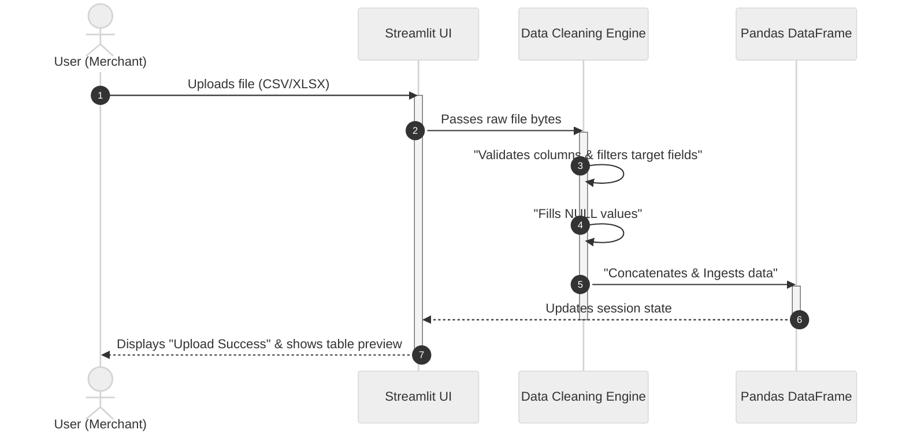
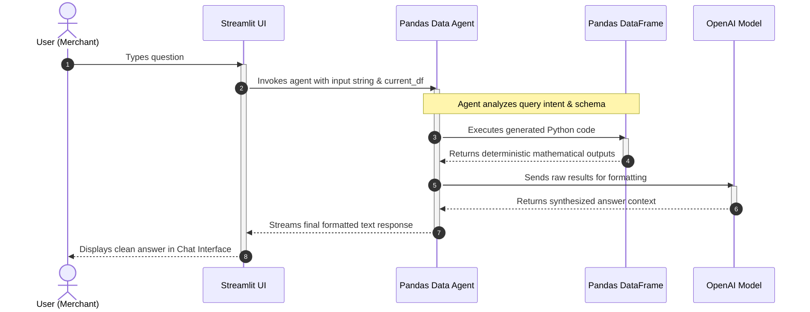

# Product Requirement Document (PRD)

## 1. Document Control & Metadata
| Field | Value |
| :--- | :--- |
| **Project Name** | RAG-Analysis |
| **Author** | Lim |
| **Version** | 1.0.0 |
| **Date** | June 7, 2026 |
| **Status** | Draft / In Review |

---

## 2. Executive Summary & Objective
### 2.1 Problem Statement
* Currently, access to business data is highly inefficient. Users must spend significant time checking records one by one, either by writing custom SQL queries or manually flipping through presentation slides.

### 2.2 Product Objective
* To build a seamless web-based application where users can upload store transaction data and interact with an AI Agent to retrieve accurate business analytics and market strategies using natural language.

---

## 3. User Personas & Target Audience
* **Primary Persona:** Small Business Owners / Retailers (Non-technical users who need quick sales insights and data-driven decisions).
* **Secondary Persona:** Data Analysts / Store Managers (Users who want to verify metrics, calculate top-performing provinces, and export filtered results).

---

## 4. Product Scope & Feature Requirements (MVP vs. Future Phases)
We follow the **MVP (Minimum Viable Product)** framework to prioritize features.

### Phase 1: Minimum Viable Product (Must-Have)
* **FR-01: File Upload Interface**
  * *Description:* The system must provide a drag-and-drop panel to upload structured tabular data in CSV/XLSX formats.
* **FR-02: Conversational Chat Interface**
  * *Description:* A clean chat UI allowing users to ask questions in natural language (Thai/English).
* **FR-03: Text-to-SQL / Analytical Engine**
  * *Description:* The backend agent must parse user intent, match it against the data schema, execute deterministic code (via Pandas or SQL), and return precise mathematical calculations (e.g., total sales, top categories).

### Phase 2: Advanced Extensions (Nice-to-Have)
* **FR-04: Guardrails & Input Safety**
  * *Description:* Implement a security layer to detect and block out-of-scope queries (e.g., prompt injections, irrelevant topics).
* **FR-05: LLM Observability & Monitoring**
  * *Description:* Integrate tracing tools (e.g., Langfuse) to log system performance, latency, and token consumption for developers.

---

## 5. System Architecture & RAG Workflow
The system's interactions are mapped via the Sequence Diagram below, splitting tasks cleanly into the Ingestion phase and the Live Query phase.

### 5.1 Data Ingestion Phase (File Upload)

### 5.2 Live Query Phase (Data Analytics Chat)

---

## 6. Success Metrics
To evaluate the success and performance of this application, the product must achieve the following metrics during testing and initial deployment:

| Metric Category | Target Key Performance Indicator (KPI) |
| :--- | :--- |
| **A. Accuracy & Data Quality** | • **Statistical Calculation Accuracy (100%):** Every analytical output (`total_amount` summation, category filtering) must perfectly match the algebraic ground truth computed by Python code. • **Intent Classification Rate (>= 90%):** The internal AI agent must correctly distinguish between data queries and strategic questions 90% of the time. |
| **B. Performance & Latency** | • **Query Response Time (Latency < 4s):** Parse query, execute code, synthesize explanation, and stream first token back to Streamlit UI within 4 seconds. • **File Processing Speed:** Ingest and clean standard flat table (`shop_data_flat.csv`) in less than 2 seconds after upload. |
| **C. Reliability & Error Recovery** | • **Graceful Degradation Rate (100%):** System must trigger a friendly user warning 100% of the time during an error instead of displaying raw tracebacks or freezing the web page. |

---

## 7. Supported Data Schema
The system expects input files to adhere to a flat table structure with the following standard columns:

| Column Name | Data Type | Business Description / Context |
| :--- | :--- | :--- |
| `customer_id` | String / Int | Unique identifier for each customer |
| `customer_name` | String | Name of the customer |
| `province` | String | Target area for localized marketing campaigns |
| `order_id` | String / Int | Unique invoice identifier |
| `order_date` | Date / String | Date of transaction |
| `payment_method` | String | Payment gateway used (e.g., Cash, Credit, PromptPay) |
| `product_name` | String | Name of the purchased product |
| `category` | String | Product category (e.g., Gaming, Apparel, Lifestyle) |
| `quantity` | Int | Number of items purchased |
| `unit_price` | Float / Numeric | Price per single unit of the product |
| `total_amount` | Float / Numeric | Mathematical target for revenue calculations (`quantity` * `unit_price`) |

---

## 8. Functional Constraints & Acceptance Criteria
* **Accuracy:** Statistical outputs (e.g., Sums, Averages, Top Counts) must perfectly align with standard algebraic calculations.
* **Error Handling (Isolation):** If the data file is missing a required column, the system must log a clear `KeyError` descriptor and show a user-friendly error message rather than crashing.
* **Complex Intent Parsing:** If a user submits multiple questions at once, the system should ideally decompose the query to prevent context pollution and maintain high response reliability.
* **Data Validation & Robustness:**
  * If the uploaded file is missing critical columns (e.g., `total_amount`, `province`), the system must gracefully reject the file and display a clear user-friendly warning message on the UI instead of crashing (`KeyError` isolation).
  * If the file contains missing fields (null/empty values) within rows, the backend engine must automatically clean the data (e.g., replacing empty provinces with 'Unknown' or empty counts with '0') to maintain mathematical accuracy during execution.